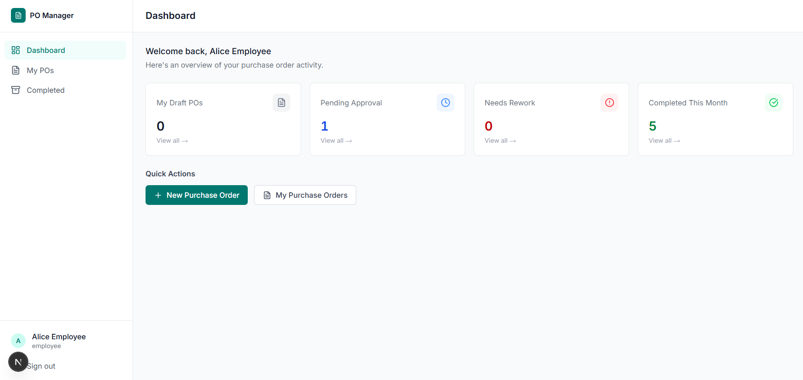
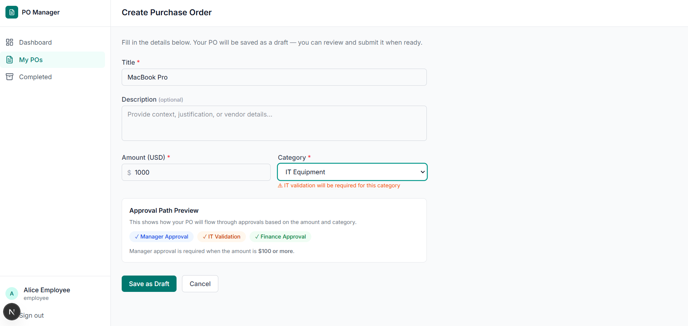
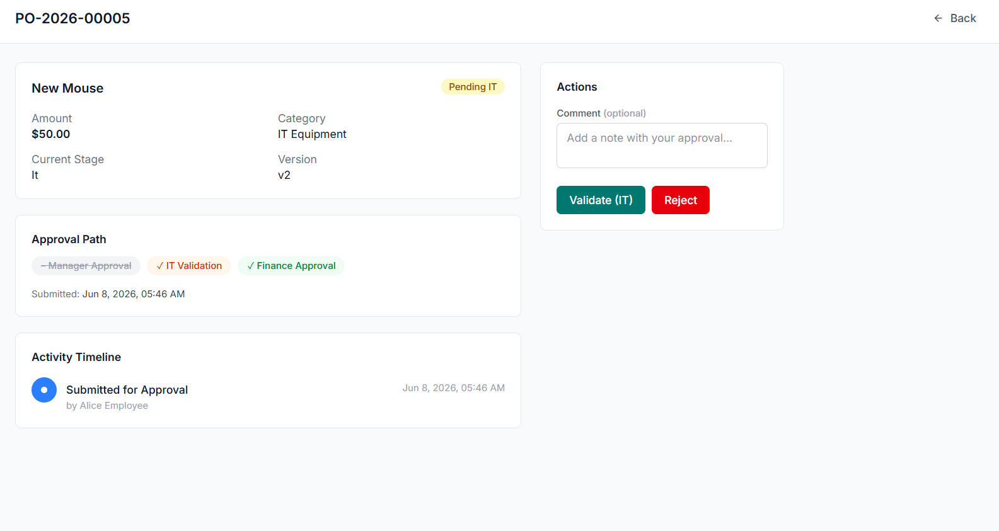
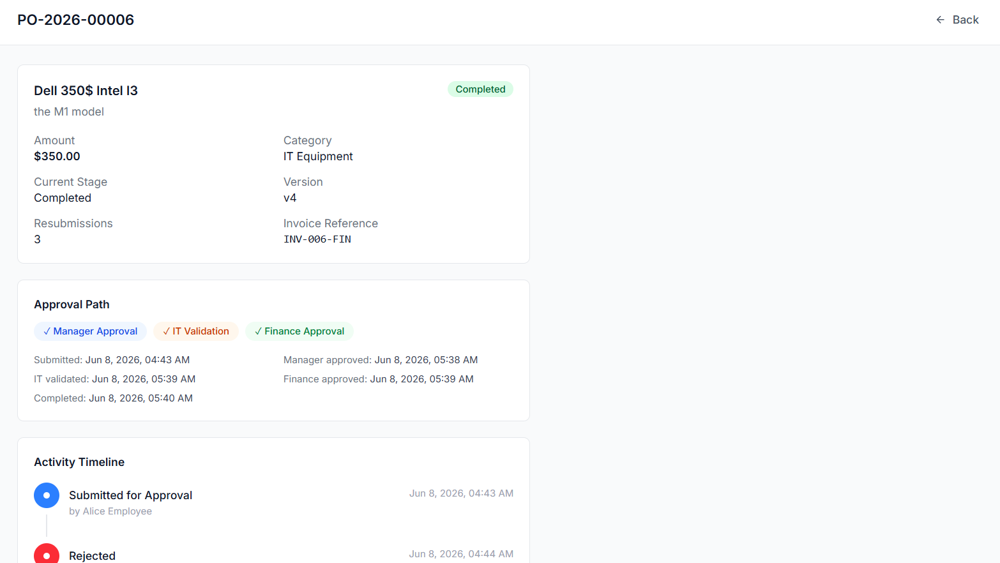
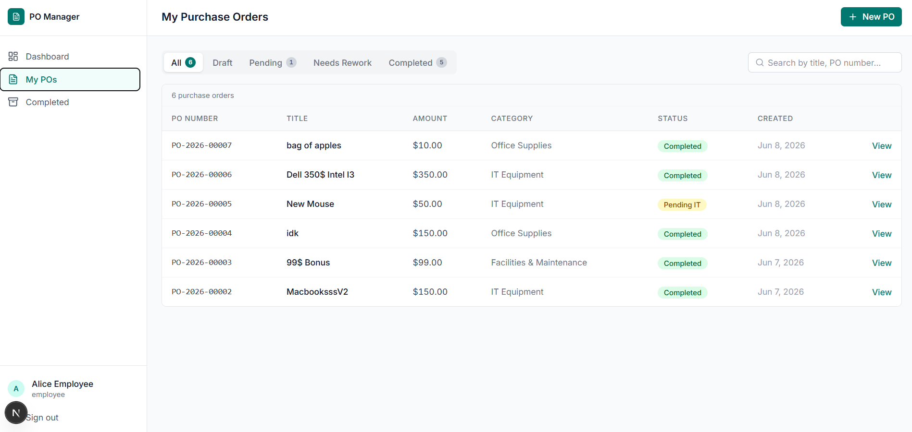
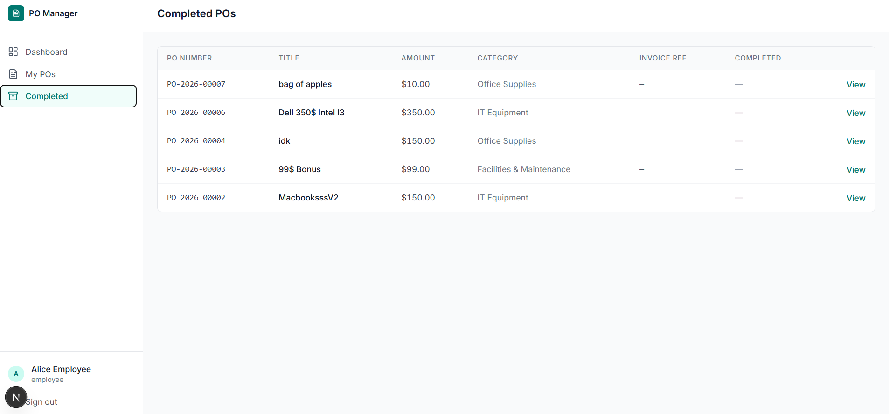
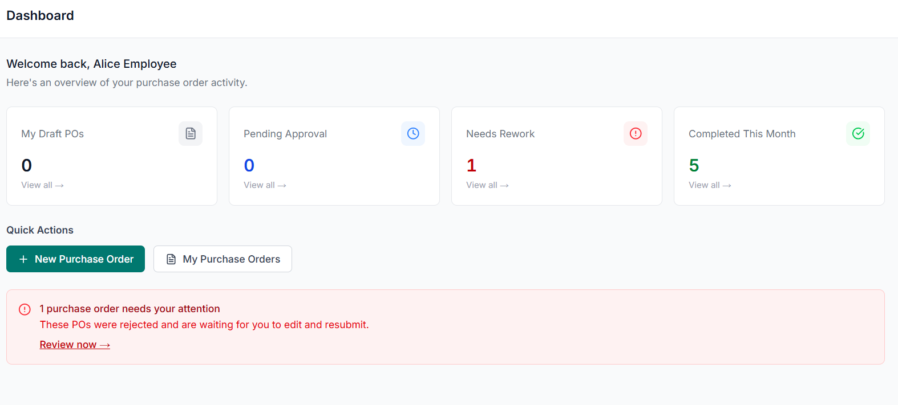
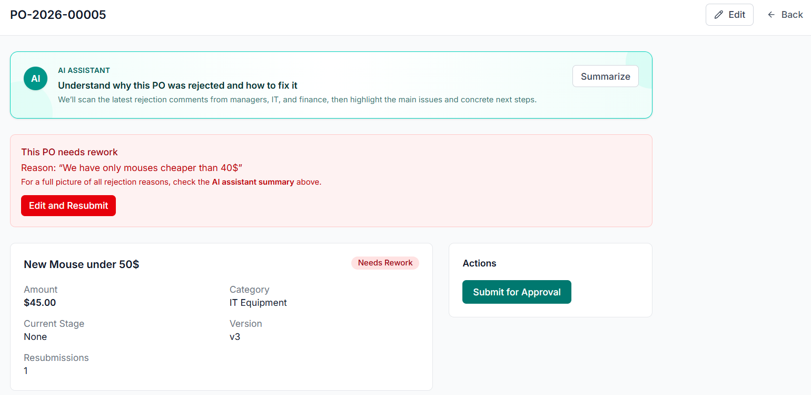

<h1>Purchase Order Management System</h1>

  This repository contains a full-stack internal Purchase Order (PO) workflow application.
  It allows employees to create purchase orders, route them through manager / IT / finance approvals,
  handle rejections and rework, and mark fully approved POs as completed and invoiced.

<h2>Employee Experience Screenshots</h2>

<h3>1. Employee Dashboard (Overview)</h3>

  The employee dashboard provides a quick overview of the user’s purchase order activity:
  number of drafts, POs pending approval, items needing rework, and POs completed this month.
  It also offers quick actions to create a new PO or navigate to the user’s PO list.

  

<h3>2. Create Purchase Order with Live Approval Path Preview</h3>

  The create PO page lets an employee enter the title, description, amount, and category.
  A live <strong>Approval Path Preview</strong> shows which stages (Manager, IT, Finance)
  will be involved based on the current amount and category (for example, IT validation
  is required for IT Equipment, and manager approval is required when the amount is at
  or above the configured threshold).

  

<h3>3. PO Approval Page for IT Validation</h3>

  Approvers (such as IT) see a focused approval screen for each PO. It shows the key
  details (title, amount, category, current stage, version) and the current approval path.
  On the right side, approvers can add an optional comment and either validate or reject
  the request, driving the workflow forward.

  

<h3>4. Completed Purchase Order Detail</h3>

  Once a PO is fully approved and completed, the detail page shows the final status,
  approval path, key timestamps (submission, manager approval, IT validation,
  finance approval, completion), invoice reference, and a complete activity timeline.
  This gives a transparent audit trail for the entire lifecycle of the PO.

  

<h3>5. My Purchase Orders List</h3>

  The <strong>My Purchase Orders</strong> page lists all POs created by the employee.
  Filters at the top allow switching between all, draft, pending, needs rework, and
  completed POs. The table shows PO number, title, amount, category, status, creation
  date, and a link to view details.

  

<h3>6. Completed POs List</h3>

  The <strong>Completed POs</strong> view focuses on purchase orders that have made it
  all the way through the workflow. It lists PO number, title, amount, category, invoice
  reference (if any), and completion status, giving employees a simple way to review
  historical purchases.

  

<h3>7. Dashboard Notification for Rejected POs</h3>

  If any purchase orders have been rejected and require rework, the employee dashboard
  highlights this with a prominent notification. This banner tells the user how many
  POs need attention and provides a quick link to review and resubmit them, keeping
  the workflow moving.

  

<h3>8. AI Assistant for POs with Multiple Rejections</h3>

  When a PO has been rejected multiple times and is in <strong>Needs Rework</strong>,
  an <strong>AI Assistant</strong> card appears at the top of the PO detail page.
  It uses the latest rejection comments from managers, IT, and finance to:

<ul>
  <li>Summarize the main reasons why the PO was rejected</li>
  <li>Suggest concrete tips to improve the PO for the next submission</li>
  <li>Let the user copy the AI-generated summary and tips with a single click</li>
</ul>

  This helps employees quickly understand feedback and converge faster on an approvable PO.

  

